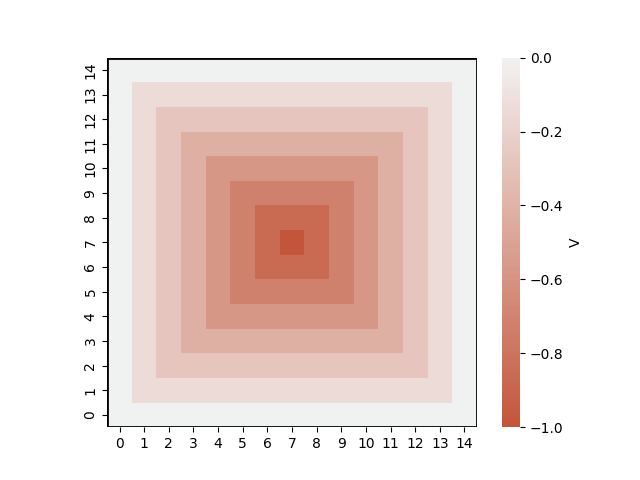

> [!NOTE]
> This page is a work-in-progress. Please feel free to message me about any typos/errors!

# Modelling spontaneous movement in aversive environments

<p align="center">
  
  
</p>

Traditionally in the computational-cognitive sciences, we would use very simple decision-making tasks (e.g. binary choice/two-arm bandit tests) to study human behaviour since they are easy to implement and interpret. This simplicity also makes the data amenable to computational modelling with e.g. model-free reinforcement learning algorithms. But, these simple tasks can quickly become quite abstract and consequently, not reveal much about how people behave in the real world.

Spatial movement is much more complex to model since the action and state space is large and everything becomes spatially and temporally correlated. But, it is also more engaging and natural for research participants. Movement is also widely used in animal studies to infer something about their inner states, very commonly in the context of anxiety. The basic idea is that we can learn about an organism's preferences by how they explore certain environments that might involve aversive locations (like raised platforms from which you can fall off). Here, I demonstrate how a simple computational model can generate behaviour that looks very similar to what is commonly seen in these animal studies, and recently also in human studies.

> [!NOTE]
> The model is fairly general, so as long as you can imagine scenarios in which an organism's motivation to explore their environment conflicts with some other innate drive, say to avoid predators or to avoid exerting effort, the following principles can be applied.

## Modelling movement in space

We first start by conceptualising movement as a series of discrete actions in discrete time, in a framework referred to as a Markov decision process (MDP). For our purposes, we will restrict movement to a two-dimensional Cartesian space. Each action can be a move in the four cardinal directions (down, up, left, right) by one unit, or an agent can also choose to remain in the same state. Here is an agent in an environment that just chooses actions at random.


> [!NOTE]
> MDPs commonly involve probabilistic transitions (i.e. the probability of transitioning to a certain state, given an action from the present state, is non-deterministic). However, to keep things simple, we implement deterministic transitions here.

### Modelling goal-directed movement

To model organisms as moving in a way that fulfils their preferences, we need to implement the concept of 'goal-directed'-ness. In the field of reinforcement learning, this often boils down to trying to maximise some kind of reward (or minimise punishment). Let's say that, an agent finds itself in an environment with some gradient in temperature. The lower left corner represents a neutral or cold temperature, which gets increasingly warmer to the top right (but not unbearably so!). An agent that finds warmth rewarding would tend to move towards the warmest area of the environment.

Thus, certain states can have _attractive_ features. These are instantiated by positive numerical values, $f(s)$, given state, $s$ (i.e. a certain location in the environment). The value of a state, $V(s)$, is the overall sum of these features.


To model choice of which direction to move in (i.e. the action, $a$, from current state, $s$), we implement a standard softmax function which considers the value of the next state, $s'$:

$$P(a|s) = \frac{e^{V(s'|s,a)}} {\sum_{a} e^{V(s'|s,a)}}$$

Now imagine that there is a gradient of something unpleasant - say an unpleasant smell. Something strange is emitting a terrible smell in the top-right corner of the environment. The stench falls off the further the agent gets from this corner, so it tends to move away from it.

This is an example of certain states having _aversive_ features. These are instantiated by negative values of $f(s)$.


The real-world is obviously not so one-dimensional. We can have both pleasant and unpleasant things occur in our environments at the same time. In our framework, we can simply sum up the various factors of attractive and aversive features to move in a goal-directed way. Let's say that we again have our gradient of warmth, but there is now an object emitting an unpleasant smell in the environment too. The agent tends to fulfil both the goals of maximising warmth and avoiding the smell at the same time.

Therefore, goal-directed movement is about maximising _overall_ reward.


### Exploration behaviour

So far, the environment has provided the features on which an agent decides to move towards/away from. But this doesn't really capture the element of _exploration_. What if there were no attractive or aversive features in the environment? How might an agent spend their time then? Humans and animals are naturally exploratory organisms, so in experiments, we often see exploratory behaviour, even in the absence of explicit reinforcers or instructions.

How can we model such spontaneous exploration? One way would be to simply make actions at random. Over time, such randomness would maybe lead us to various parts of the environment.


You've probably considered the idea that this isn't a very efficient use of time. This is because this is an *undirected* exploration strategy - it does not explore on the basis of any information. Maybe there is a more targeted way to explore an environment.

Here, we draw on a concept from the artificial intelligence literature - that of **count-based exploration** methods (a form of *directed* exploration strategy). The basic principle is that exploration is about visiting _unfamiliar_ states. Without other sources of information, one easy way that we can operationalise state familiarity is simply the number of times a state has been visited in the past. Low numbers of previous visits means that the state is not familiar to the agent and warrants exploration - as the state is visited more frequently, it becomes more familiar. We can implement this computationally with an _intrinsic_ reward signal, $r_{int}$, that an agent experience upon entering a certain state, $s$, which is discounted as the number of visits to that state, $n(s)$, increases:

$$r_{int}(s) = \frac{1}{(n(s) + 1)^{\tau}}$$

where $\tau$ is a parameter that controls the rate of intrinsic reward decay over visits.

Here is an agent that accrues more reward for exploring less-visited states of the environment.


As we can see, it is much more efficient at exploring compared to the agent which explores at random.

### Putting it all together

The final pieces of the puzzle are as follows:

To model exploration in environments with certain salient features, we model agents as moving to maximise both extrinsic and intrinsic reward, given by a weighted sum of these reward signals. The weights can vary from agent to agent, indicating their preference for exploration vs goal-directed behaviour (by 'goal-directed' here, I mean behaviour motivated by extrinsic rewards, even though exploration could be a goal in itself).

$$R = \beta_{int} \cdot r_{int} + \beta_{ext} \cdot r_{ext}$$

Since states are spatially/temporally correlated, we model the values of states according to the Bellman equation, where state-values are a function of both the immediately available reward and those of successive states, discounted by time (according to a temporal discount parameter, $\gamma$):

$$V(s) = R(s) + \gamma \sum_{s'} P(s'|s)V(s')$$

This equation is frequently conditioned on a policy optimised for reward pursuit, but we implement a fixed policy of uniform probability over actions from each state. This has an important benefit, which is that we can use the matrix form of the Bellman equation instead of dynamic programming methods (e.g. value iteration) to solve for the value function directly:

$$V = R + \gamma PV = (1-\gamma P)^{-1}R$$

which is much more computationally efficient. This will be important for fitting the model to empirical data (see below).

## Applying the model to classical rodent experiments

As I mentioned above, movement tasks are used a lot in the rodent literature to measure anxiety-like behaviour. How? By seeing how rodents move when they are placed into certain environments, which involve features that are innately aversive to them. In this way, their natural drive to explore is pitted against the drives to avoid these aversive features. Subjects that show a preference for exploration are interpreted as showing low anxiety behaviour, whilst those that prefer avoidance are thought to be exhibiting high-anxiety behaviour. These interpretations are supported by the fact that drugs which reduce anxiety in humans typically make rodents explore more in these tests.

### The open field test

<p align="center">
  
  
</p>

[Image source](https://ja.brc.riken.jp/lab/jmc/mouse_clinic/en/pipeline_en/pipeline_02.htm)

The first test we will model is the open field test, which simply involves a square (or circular) environment enclosed by walls. Rodents are prey animals, so walls provide safety by limiting the directions that they can be attacked by a predator. Therefore, staying close to the walls represents a high-anxiety behaviour, whereas subjects that explore more central parts of the environment are interpreted as having lower anxiety. On the heatmap above, I show that we can model this effect by ascribing increasingly negative state values as the distance from the perimeter increases.

On the left, I show an agent that ascribes low weight to the environmental features, meaning that they find the central parts of the environment less aversive. This agent explores the full environment freely. On the right, I show an agent with much higher weight on the environmental features - this one is much more averse to central positions. This makes the agent more likely to explore the environment by staying close to the perimeters - we can see that they traverse the wall around the environment.

<p align="center">
  
  
</p>

### The light dark box

<p align="center">
  
  
</p>

[Image source](https://journals.plos.org/plosone/article?id=10.1371/journal.pone.0114626)

The light dark box test involves two compartments, one of which is exposed to light and the other is covered to provide darkness. Rodents are nocturnal animals so prefer darkness, in general. In this test, staying in the dark compartment represents the high-anxiety behaviour, whereas venturing into the light compartment is interpreted as a demonstration of low(er) anxiety. To model this environment, we can simply ascribe a negative value to states in the dark compartment (see heatmap above).

Again, the simulation on the left shows an agent that doesn't find brightly lit spaces particularly aversive, whereas the agent on the right is averse to light and so remains in the dark compartment.

<p align="center">
  
  
</p>

### The elevated plus maze

<p align="center">
  
  
</p>

[Image source](https://en.wikipedia.org/wiki/Elevated_plus_maze)

The elevated plus maze is a raised platform that consists of two axes of arms: the closed arms have barriers that prevent falling and provide shelter, whilst the open arms are exposed to the height and the broader environment. Rodents typically prefer to remain on the closed arms, especially when anxious. To model this environment, we can simply ascribe a negative value to states on the open arms (see heatmap above).

Again, the simulation on the left shows an agent that is insensitive to exposure on the open arms, whereas the agent on the right shows more 'anxious' behaviour. (The open arms here are those on the north-south axis.)

<p align="center">
  
  
</p>

## Model validation

These simulations look interesting, but do they actually model how real organisms behave?

We are currently fitting the model to the raw movement data from a human mixed-reality elevated plus maze study [(Biedermann et al., 2017)](https://bmcbiol.biomedcentral.com/articles/10.1186/s12915-017-0463-6) - so watch this space!


Image from [paper](https://bmcbiol.biomedcentral.com/articles/10.1186/s12915-017-0463-6).


## Installation

To run the models yourself, clone the repository and install the required dependencies:

```bash
git clone https://github.com/yumeya-yamamori/exploration-avoidance-RL.git
cd exploration-avoidance-RL
pip install -r requirements.txt
```

## Usage
To run the model and/or generate your own simulations, please refer to [`generate_simulations.ipynb`](generate_simulations.ipynb).

The core model implementation is written in [`model.py`](model.py).

## References

Sutton & Barto. "[Reinforcement learning: An introduction (2nd ed.)](https://mitpress.mit.edu/9780262193986/reinforcement-learning/)". The MIT Press 2018.

Haoran, et al. "[#Exploration: A Study of Count-Based Exploration for Deep Reinforcement Learning](https://arxiv.org/abs/1611.04717)”. NIPS 2017.
